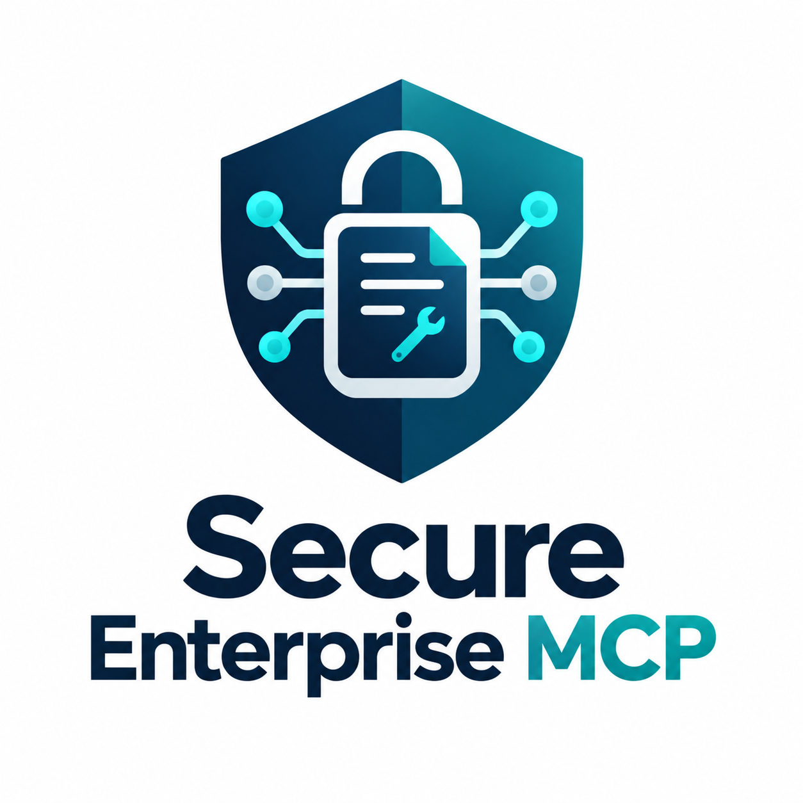

<p align="center">
  
</p>

<p align="center">
  <strong>
    A security focused MCP reference implementation for exposing enterprise
    tools to AI agents while enforcing least privilege, declarative policy,
    trusted data boundaries, and auditability independently of model behavior.
  </strong>
</p>

<p align="center">
  <a href="./SECURITY.md">Security Model</a> •
  <a href="./DESIGN.md">Architecture & Design</a> •
  <a href="./RUNDEMO.md">Run the Demo</a>
</p>

---

## Overview

Secure Enterprise MCP explores how enterprise capabilities can be exposed
through Model Context Protocol (MCP) without treating the AI model as a trusted
security boundary.

The project currently implements an MCP client and server over stdio with
server-side identity simulation, declarative tool policy, scope-based
authorization, trusted/quarantined data separation, path traversal protection,
and structured security audit events.

## Current Security Controls

- Scope based MCP tool authorization
- Declarative YAML tool governance
- Fail-closed policy enforcement
- Least-privilege principals
- Trusted and quarantined data boundaries
- Path traversal protection
- Structured authorization audit events
- Explicit MCP subprocess environment propagation
- Tool errors handled as expected security outcomes

## Architecture

```text
                MCP Client
                    │
                    │ MCP over stdio
                    ▼
              MCP Server
                    │
          ┌─────────┼─────────┐
          │         │         │
          ▼         ▼         ▼
       Identity   Policy   Authorization
          │         │         │
          └─────────┴─────────┘
                    │
                    ▼
              MCP Tool Layer
                    │
           ┌────────┴────────┐
           ▼                 ▼
      Trusted Data       Quarantine
      search / read      untrusted data
