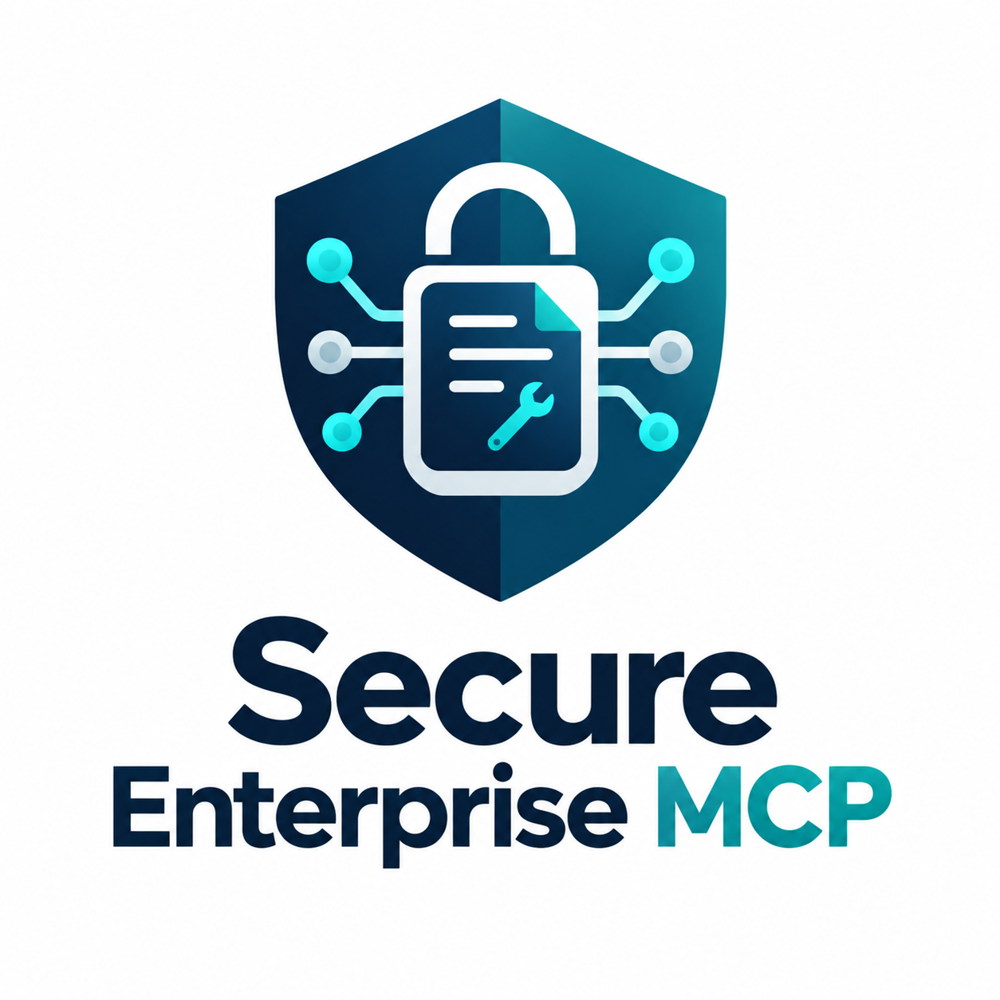

<p align="center">
  
</p>

<p align="center">
  <strong>
    A security focused MCP reference implementation for exposing enterprise
    tools to AI agents while enforcing least privilege, declarative policy,
    trusted data boundaries, and auditability independently of model behavior.
  </strong>
</p>

<p align="center">
  <a href="./SECURITY.md">Security Model</a> •
  <a href="./DESIGN.md">Architecture & Design</a> •
  <a href="./RUNDEMO.md">Run the Demo</a>
</p>

---

## Overview

Secure Enterprise MCP explores how enterprise capabilities can be exposed
through Model Context Protocol (MCP) without treating the AI model as a trusted
security boundary.

The project currently implements an MCP client and server over stdio with
server-side identity simulation, declarative tool policy, scope-based
authorization, trusted/quarantined data separation, path traversal protection,
and structured security audit events.

## Current Security Controls

- Scope based MCP tool authorization
- Declarative YAML tool governance
- Fail-closed policy enforcement (ALLOW, REQUEST_APPROVAL, DENY)
- Least-privilege principals
- Trusted and quarantined data boundaries
- Path traversal protection
- Structured authorization audit events
- Explicit MCP subprocess environment propagation
- Tool errors handled as expected security outcomes

## System Architecture 

```text
 
                MCP Client
                    │
                    │ MCP over stdio
                    ▼
              MCP Server
                    │
          ┌─────────┼─────────┐
          │         │         │
          ▼         ▼         ▼
       Identity   Policy   Authorization
          │         │         │
          └─────────┴─────────┘
                    │
                    ▼
              MCP Tool Layer
                    │
           ┌────────┴────────┐
           ▼                 ▼
      Trusted Data       Quarantine
      search / read      untrusted data
```
## Security Control Flow for Sensitive Outbound Action with ALLOW
```
        Agent requests: 
        send_enterprise_document(
            document_id="...",
            destination="..."
        )

            │
            ▼
      Authentication
            │
            ▼
      Authorization
            │
            ▼
      Policy evaluation
            │
      ┌─────┴─────┐
      │           │
    DENY       ALLOWED
                  │
          approval required?
                  │
             YES  ▼
            PENDING
                  │
             Human decision
              /        \
         APPROVE       DENY
            │            │
            ▼            ▼
          SEND        BLOCK
            │            │
            └─────┬──────┘
                  ▼
             Audit event
```
## **Human Approval Control Plane** 

      - Approval model → ApprovalRequest + ApprovalStatus
      - Approval store / state machine → ApprovalStore

Approval represents explicit authorization for one exact sensitive action. It is bound to the requesting principal, tool, resource, and destination. It expires. It cannot be issued through the agent accessible MCP interface. It is single-use. And all state transitions are auditable.

        Approval Store Implementation

    Human Approval subsystem
    ├── ApprovalRequest model
    ├── ApprovalStatus state machine
    └── ApprovalStore
        ├── create → PENDING
        ├── approve → APPROVED
        ├── deny → DENIED
        ├── expire → read current state / expire if needed
        └── consume → validate exact request + APPROVED → CONSUMED

### Approval Audit Trail

Approval lifecycle events are emitted as structured JSONL security records.

The audit trail captures approval requests, human decisions, expiration,
successful consumption, and blocked attempts without recording sensitive
document contents or credentials.

For example, an approved action can still be blocked if an agent attempts
to substitute a different destination:

```
approval_request      pending
approval_decision     approved
approval_consumption  blocked   reason=destination_mismatch
approval_consumption  consumed
```
A sanitized example audit trail is available at examples/sample_audit.jsonl